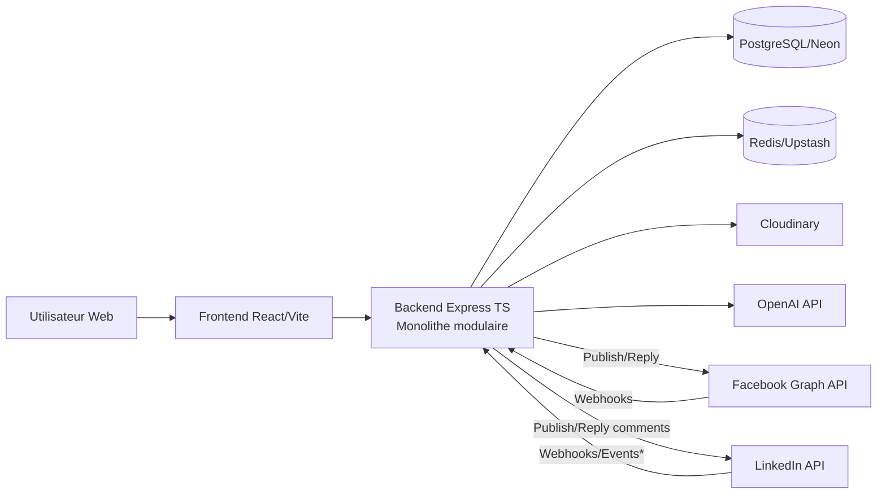
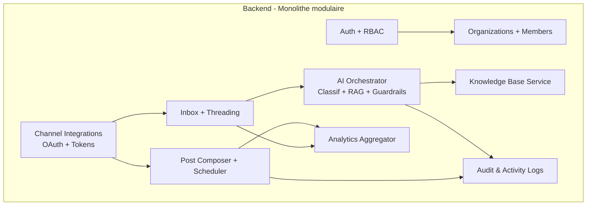
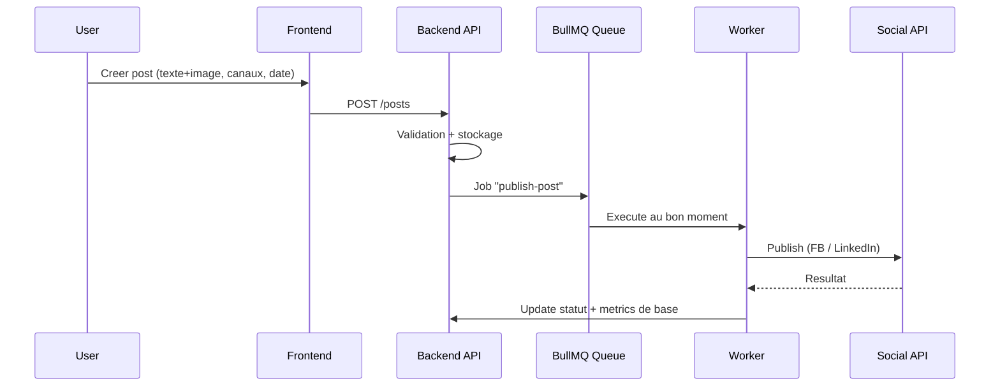
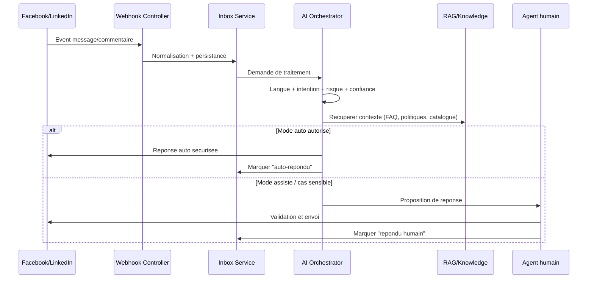

# Diagrammes d'Architecture (Mermaid)

## 1) Vue globale

```mermaid
flowchart LR
    U[Utilisateur Web] --> FE[Frontend React/Vite]
    FE --> API[Backend Express TS\nMonolithe modulaire]

    API --> DB[(PostgreSQL/Neon)]
    API --> REDIS[(Redis/Upstash)]
    API --> CLD[Cloudinary]
    API --> OAI[OpenAI API]

    FB[Facebook Graph API] -->|Webhooks| API
    API -->|Publish/Reply| FB

    LI[LinkedIn API] -->|Webhooks/Events*| API
    API -->|Publish/Reply comments| LI
```

> *Selon disponibilite des endpoints et permissions.

## 2) Modules backend

```mermaid
flowchart TB
    subgraph Core[Backend - Monolithe modulaire]
        AUTH[Auth + RBAC]
        ORG[Organizations + Members]
        CH[Channel Integrations\nOAuth + Tokens]
        POSTS[Post Composer + Scheduler]
        INBOX[Inbox + Threading]
        AI[AI Orchestrator\nClassif + RAG + Guardrails]
        ANA[Analytics Aggregator]
        AUDIT[Audit & Activity Logs]
        KB[Knowledge Base Service]
    end

    AUTH --> ORG
    CH --> POSTS
    CH --> INBOX
    INBOX --> AI
    AI --> KB
    POSTS --> ANA
    INBOX --> ANA
    AI --> AUDIT
    POSTS --> AUDIT
```

## 3) Flux scheduler publication

```mermaid
sequenceDiagram
    participant User
    participant FE as Frontend
    participant API as Backend API
    participant Q as BullMQ Queue
    participant W as Worker
    participant Social as Social API

    User->>FE: Creer post (texte+image, canaux, date)
    FE->>API: POST /posts
    API->>API: Validation + stockage
    API->>Q: Job "publish-post"
    Q->>W: Execute au bon moment
    W->>Social: Publish (FB / LinkedIn)
    Social-->>W: Resultat
    W->>API: Update statut + metrics de base
```

## 4) Flux inbox + IA

```mermaid
sequenceDiagram
    participant Social as Facebook/LinkedIn
    participant WH as Webhook Controller
    participant IN as Inbox Service
    participant AI as AI Orchestrator
    participant KB as RAG/Knowledge
    participant Agent as Agent humain

    Social->>WH: Event message/commentaire
    WH->>IN: Normalisation + persistance
    IN->>AI: Demande de traitement
    AI->>AI: Langue + intention + risque + confiance
    AI->>KB: Recuperer contexte (FAQ, politiques, catalogue)

    alt Mode auto autorise
        AI->>Social: Reponse auto securisee
        AI->>IN: Marquer "auto-repondu"
    else Mode assiste / cas sensible
        AI->>Agent: Proposition de reponse
        Agent->>Social: Validation et envoi
        Agent->>IN: Marquer "repondu humain"
    end
```
